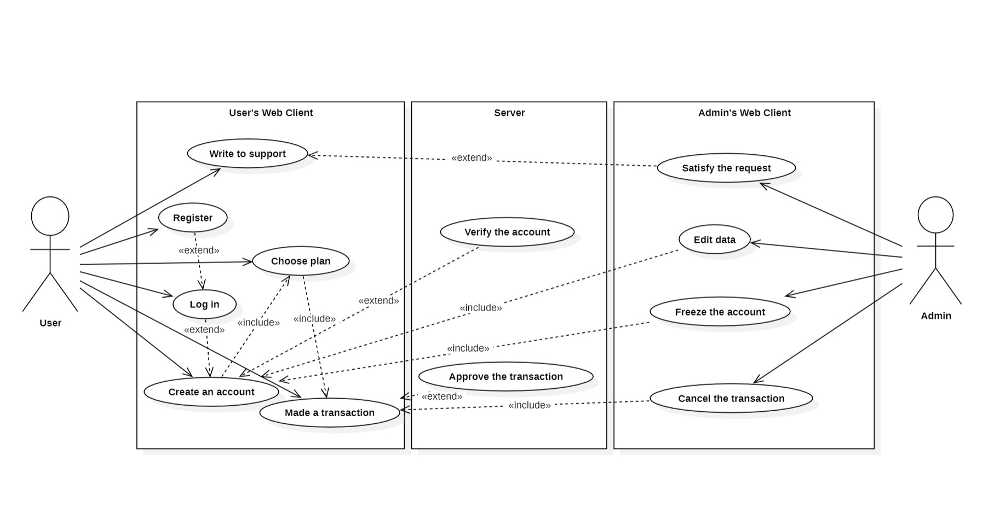

## Банковская система. Описание проекта.

#### Над проектом работали:
- Барилов Денис Б05-322
- Калинин Михаил Б05-322
- Удовенко Артём Б05-323.

### Общее описание

Проект "Банковская система" представляет собой комплексную реализацию системы для финансовых операций и управления данными клиентов и счетов в различных банках. В системе есть несколько банков, каждый из которых предоставляет финансовые услуги, такие как открытие и управление счетами, проведение транзакций и другие операции.
>В основе системы лежит концепция клиентских аккаунтов (которых у одного пользователя может по одному на банк) и счетов (привязанных к банку и тарифу).
> 
Клиенты имеют персональные данные, такие как имя, фамилия, адрес и номер паспорта, которые могут быть указаны при создании учетной записи. Счета могут быть дебетовыми, кредитными или депозитными (у банков может быть по несколько тарифов одного вида).
Кроме того, предусмотрены различные действующие лица: клиенты и администраторы. Первые могут работать лишь с счетами, которые им принадлежат, а вторые - получать информацию о чем угодно, а также отменять произведенные транзакции.

### Виды счетов
| __Дебетовый счет__          | __Депозитный счет__                                                                                                                             | __Кредитный счет__                                                                                                                   |
|-----------------------------|-------------------------------------------------------------------------------------------------------------------------------------------------|--------------------------------------------------------------------------------------------------------------------------------------|
| Позволяет снимать деньги в любое время, но не позволяет уходить в минус | Предоставляет возможность хранить средства без возможности снятия до истечения срока депозита, при этом получая накопительный процент по вкладу | Имеет кредитный лимит, позволяющий клиенту уходить в минус, но влечет за собой комиссии за использование (при отрицательном остатке) |

### How2
Для запуска проекта необходимо склонировать этот репозиторий и запускать один из двух файлов: main.py или old_main.py (второй возможно изменять для ручного тестирования). Никаких сторонних библиотек скачивать не нужно.
Примерный список команд для Linux:
```commandline
git init
git clone https://gitlab.akhcheck.ru/denis.barilov/miptpay.git
pip install django
pip install python-dateutil
$env:PYTHONPATH = ";C:\Users\<path to project folder>"
cd miptpay/src
python3 manage.py migrate
# Нужно перевести проект в режим заполнения
# базы данных тестовой информацией.
# Открыть файл miptpay/src/__init__.py
# Раскомментировать 5 строчку (django.setup())
python3 ../tests/sampledata.py
# если скрипт выполнен успешно, данные подгружены в базу
# закомментировать 5 строчку обратно
python3 manage.py runserver    
```

### Доступные страницы
Необходимо перейти по [ссылке](http://127.0.0.1:8000/home/) (http://127.0.0.1:8000/home/). Вы окажетесь на стартовой странице. Если пользователь не зарегистрирован, нужно пройти регистрацию. После заполнения полей, вы попадете на домашнюю страницу.
Существуют следующие страницы:
/banks
/plans
/persons
/clients
/account
/transactions
/accounts/login
/home