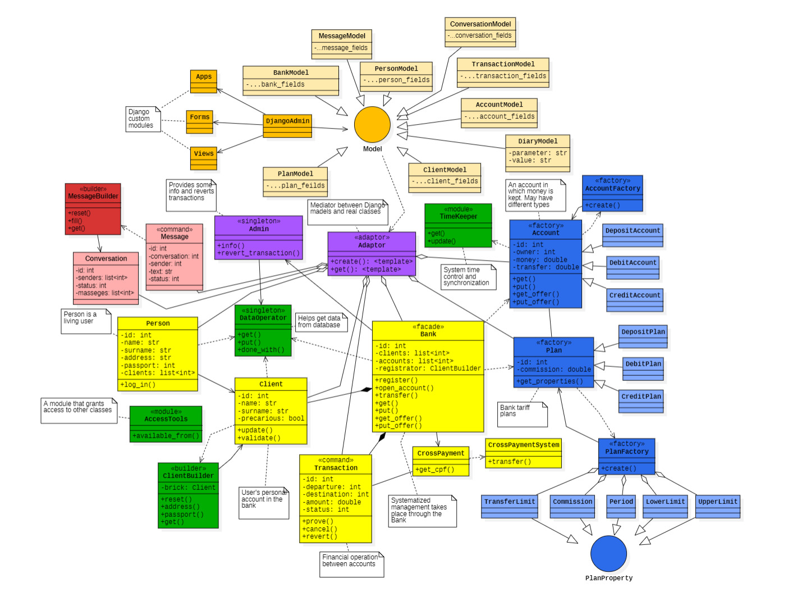

### Паттерны

Система реализована с использованием различных паттернов проектирования. В их числе:

1.	[Builder](https://en.wikipedia.org/wiki/Builder_pattern) (При создании объекта клиента, а также сообщений)
2.	[Factory Method](https://en.wikipedia.org/wiki/Factory_method_pattern) (При создании объекта счета)
3.	[Abstract Factory](https://en.wikipedia.org/wiki/Abstract_factory_pattern) (При создании объекта плана)
4.	[Singleton](https://en.wikipedia.org/wiki/Singleton_pattern) (При взаимодействии с системой кросс-банковых)
5.	[Facade](https://en.wikipedia.org/wiki/Facade_pattern) (для упрощения взаимодействия между клиентом и банком)

и другие

### Реализация

_На диаграме отображены лишь основные классы_

#### Нововведения 3 итерации

- В проект встроен собственный [мессенджер](http://localhost:8000/chats)
- Введена возможность создания новых логических единиц (банков, счетов и подобного) в интерфейсе сайта
- Персонализированы отображаемые пользователям данные
- Введено разделение отображаемых администраторам и рядовым пользователям страниц
- Усовершенствованы алгоритмы определение неверного (и неформатного) ввода
- Страница регистрации обрела актуальный дизайн
- Теперь в проекте активно используются не только тела запросов, но и query-параметры

#### Настройка временных интервалов

Предусмотрено несколько вариантов интервалов начисления процентов. Выбрать нужный режим можно в [toml файле](../pyproject.toml).