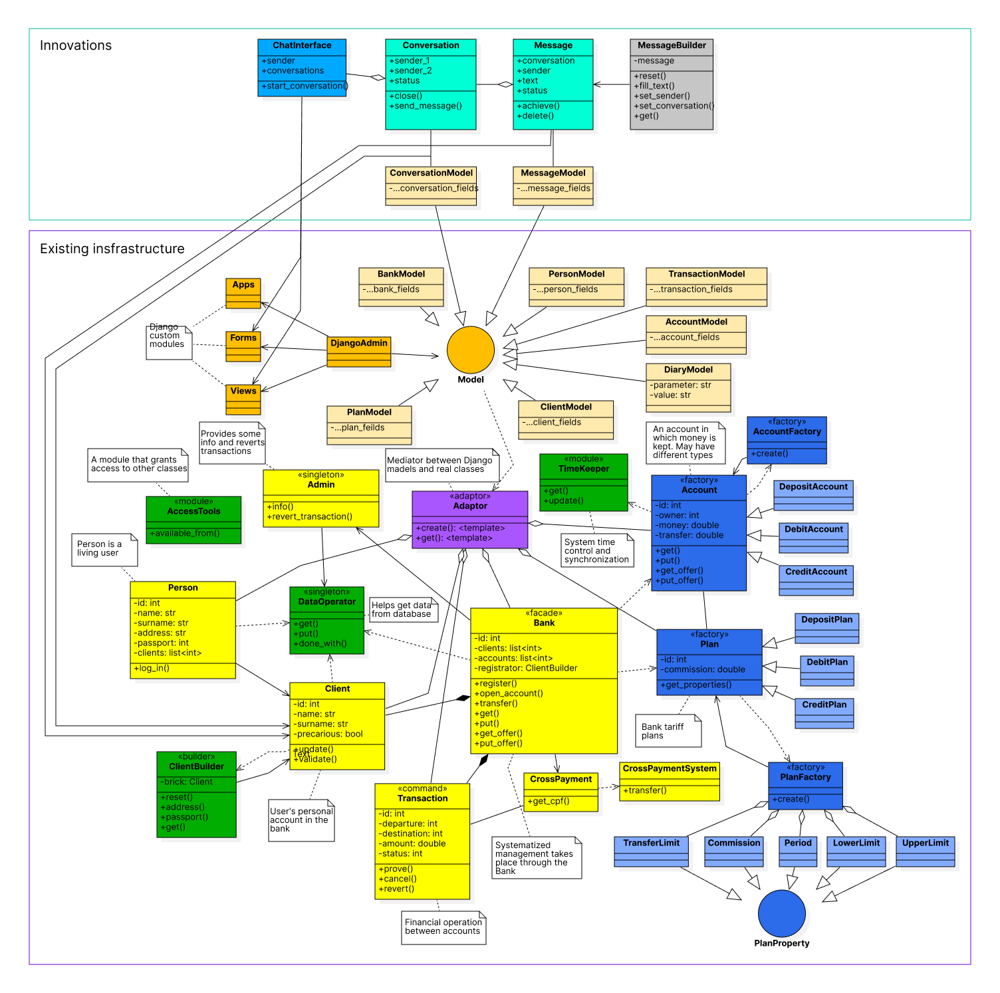

## Задача подпроекта

В качестве основы для нововведений был взят реализуемый проект по Технологиям Программирования. MIPTpay - сайт-симмуляция банковской системы с поддержкой нескольких банков, различных видов счетов и любого количества тарифов и клиентов. Требуется реализовать функциональность переписок пользователей сайта в архитектуре Django и SQLite. В итоге проект будет с запасом удовлетворять всем требованиям обоих курсов.

## Описание

На одной из страниц сайта будет отображаться страница чатов пользователя подобно тому, как это выглядит в популярных мессенджерах. Пользователи смогут создавать чаты и обмениваться сообщениями. Информация о переписках будет сохранена в базе данных.

## Архитектура решения

На UML диаграмме разделены реализованная часть проекта и реализуемое дополнение.

## Примечания

Более подробное описание проекта можно найти в основных README файлах: [общий](../../README.md) и [архитектурный](../README.md).

Возможность реализации такого дополнения к проекту была предварительно обговорена в личных сообщениях Telegram.
